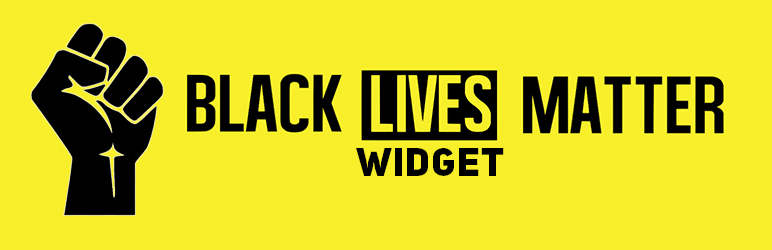

# Black Lives Matter WordPress Widget

> Floating Widget for solidarity with Black Lives Matter Campaign

## Features
- [x] Floating Widget on All Pages of Website with message
- [x] Enable or Disable the Widget from Admin Panel
- [x] Customize your Message text
- [x] Customize background and text colors to match your brand identity

## Meta

Atiq Samtia– [@AtiqSamtia](https://twitter.com/atiqsamtia) – me@atiqsamtia.com

Distributed under the GPL3 license.

[https://github.com/atiqsamtia/black-lives-matter-wordpress-widget](https://github.com/atiqsamtia/black-lives-matter-wordpress-widget)

## Contributing

1. Fork it (<https://github.com/atiqsamtia/black-lives-matter-wordpress-widget/fork>)
2. Create your feature branch (`git checkout -b feature/fooBar`)
3. Commit your changes (`git commit -am 'Add some fooBar'`)
4. Push to the branch (`git push origin feature/fooBar`)
5. Create a new Pull Request
